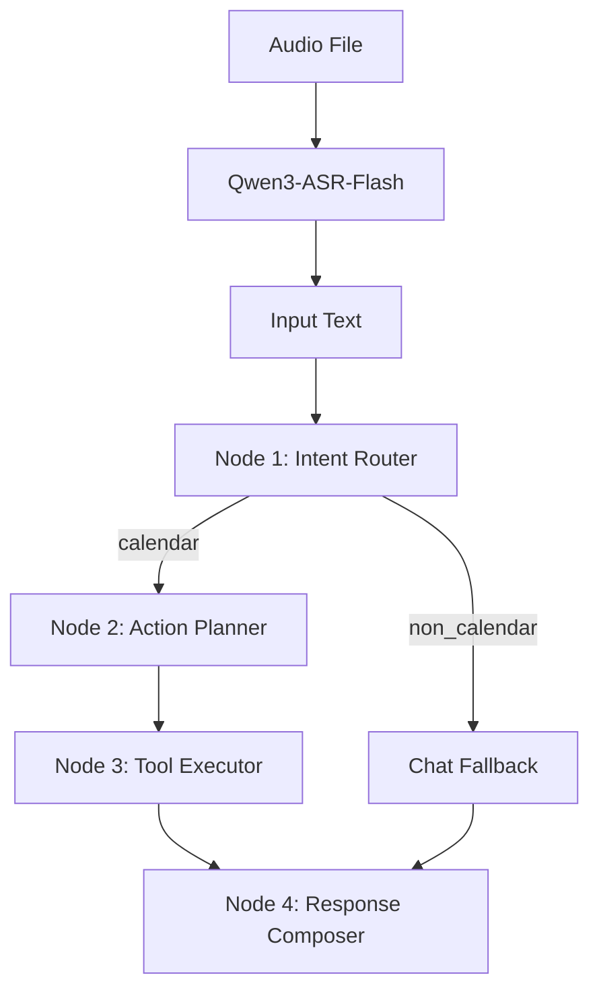

# PR3 设计说明：语音文本 Agent 链路

## 1. PR3 目标

PR3 负责把音频或语音转文字后的文本转换为可执行的日程操作。

PR3 支持两种输入：

1. 前端上传音频，后端调用 Qwen3-ASR-Flash 转成文本；
2. 前端已经完成语音识别，直接提交文本。

```json
{
  "text": "把明天下午三点的会改到四点",
  "timezone": "Asia/Shanghai"
}
```

PR3 需要交付：

- 意图识别；
- 日程 action plan 生成；
- LangGraph 工具执行编排；
- LangChain + OpenAI action plan 生成；
- Qwen3-ASR-Flash 音频转写；
- 自然语言结果回复；
- `/api/transcriptions` 接口；
- `/api/voice-command` 接口。

## 2. Agent 链路



## 3. Node 1：Intent Router

职责：判断用户输入是否和日程相关。

输出 intent：

- `calendar`：日程相关；
- `smalltalk`：闲聊；
- `unsupported`：不是当前 MVP 支持的能力；
- `unclear`：表达不清楚。

非日程内容不进入工具执行，而是返回友好引导：

> 我现在主要能帮你管理日程。你可以试试说：“明天下午三点开会”。

## 4. Node 2：Action Planner

职责：把日程相关文本转换为结构化 action plan。

设计原则：

- 永远返回 `actions` 数组；
- 当前 MVP 支持按顺序执行多条 action；
- 一句话多条指令必须拆成多个 action；
- LangChain 调用 OpenAI 模型生成 action plan；
- LLM 只负责理解和规划，不直接写数据库；
- 如果未配置 `OPENAI_API_KEY`，后端使用规则 fallback 保证 demo 可跑。

Action plan 示例：

```json
{
  "intent": "calendar",
  "actions": [
    {
      "type": "create_event",
      "arguments": {
        "title": "和 Alex 开会",
        "start_time": "2026-05-31T15:00:00+08:00",
        "end_time": null,
        "notes": null,
        "recurrence_type": "none",
        "recurrence_interval": 1,
        "recurrence_until": null
      }
    }
  ]
}
```

支持 action 类型：

- `create_event`；
- `query_events`；
- `update_event`；
- `delete_event`。

## 5. Node 3：Tool Executor

职责：把 action plan 映射到后端确定性工具。

Executor 只能调用事件 service，不能直接操作数据库。

工具映射：

| Action | Tool |
|--------|------|
| `create_event` | `create_event(user_id, data)` |
| `query_events` | `list_events(user_id, filters)` |
| `update_event` | 先查候选事件，再 `update_event(user_id, id, data)` |
| `delete_event` | 先查候选事件，再 `delete_event(user_id, id)` |

修改和删除的候选匹配规则：

1. 优先使用明确时间范围；
2. 再使用标题关键词；
3. 匹配 0 个：返回 `not_found`；
4. 匹配 1 个：自动执行；
5. 匹配多个：返回 `needs_selection` 和 `candidates`。

## 6. Node 4：Response Composer

职责：把工具执行结果转换为用户可读回复。

Response Composer 不修改数据库，只根据结构化结果生成：

- `message`；
- `status`；
- `events`；
- `candidates`。

## 7. `/api/voice-command` 响应结构

```json
{
  "intent": "calendar",
  "status": "success",
  "message": "已帮你创建明天下午三点的会议。",
  "actions": [],
  "results": [],
  "events": [],
  "candidates": []
}
```

## 8. `/api/transcriptions` 响应结构

请求：

```text
POST /api/transcriptions
Content-Type: multipart/form-data
Authorization: Bearer <token>

file=<audio file>
```

响应：

```json
{
  "text": "明天下午三点和 Alex 开会"
}
```

状态值：

- `success`；
- `needs_selection`；
- `not_found`；
- `unsupported`；
- `error`。

## 9. PR3 非目标

PR3 不实现：

- 多轮对话记忆；
- 单次循环实例修改；
- 团队日历；
- 前端页面。

## 10. 技术栈

- 阿里云百炼 DashScope OpenAI 兼容 API：音频转文字与模型调用；
- Qwen3-ASR-Flash：音频转文字；
- LangChain：调用 OpenAI 文本模型生成 action plan；
- LangGraph：编排 intent router、action planner、tool executor、response composer；
- Flask：提供 HTTP API。

## 11. Commit 规划

所有 commit message 使用 Angular 风格：

1. `docs - add pr3 agent design`
2. `feat - add voice command schema`
3. `feat - add llm command parser`
4. `feat - add voice command executor`
5. `feat - add voice command api`
6. `feat - add openai audio transcription api`
7. `refactor - orchestrate voice command with langgraph`
